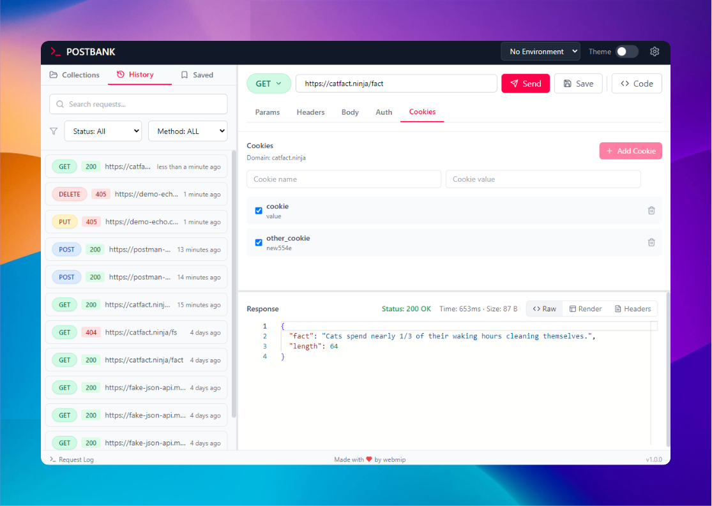

# Postbank - Open Source, Offline API Client

Welcome to **Postbank**, a fully offline, open-source API client designed to simplify your interaction with APIs. With features that rival popular tools like Postman, this app focuses on privacy, ease of use, and flexibility, running entirely on your local machine.



---

## 🎯 Key Features
- **Make HTTP/HTTPS Requests**: Send GET, POST, PUT, DELETE, and other HTTP methods with ease.
- **Request History**: Automatically save your request history for easy access, or clear it anytime.
- **JSON Collections**: Import and manage collections of API requests in JSON format.
- **Environment Variables**: Manage multiple environments and switch between them seamlessly.
- **Save Requests Locally**: Organize and save your API requests for reuse.
- **Privacy-First**: 
  - 100% offline—no data is sent outside your device.
  - All data is stored locally, giving you full control over your information.
  - No user accounts required.
- **Cross-Platform**: Download prebuilt binaries for **Windows** and **macOS** or build it yourself from source.
- **Customizable and Open Source**: Fully transparent codebase built with Electron and React, enabling developers to adapt the app to their needs.

---

## 🚀 Getting Started

### Download and Install
Prebuilt binaries are available for Windows and macOS:

Alternatively, clone the repository and build it locally (see instructions below).

---

### Usage
1. **Launch the app**: No installation required; simply open the app.
2. **Send requests**: Choose the HTTP method, provide the URL, add headers/body, and send.
3. **Save and organize requests**: Store frequently used requests and manage collections.
4. **Manage environments**: Use variables for seamless switching between development, staging, and production APIs.
5. **Offline-first**: Your data never leaves your device.

---

## 🔧 Building from Source

Ensure you have **Node.js** and **npm** installed.

1. Clone the repository:
   ```bash
   git clone https://github.com/webmip/postbank
   cd Postbank
   ```
2. Install dependencies:
   ```bash
   npm install
   ```
3. Build the app for production:
   ```bash
   npm run electron:build:win
   npm run electron:build:mac
   ```

---


## 🛠 Contributing

We ❤️ contributions! Your help is what makes **Postbank** better every day. Here's how you can contribute:
Whether it's fixing a bug, adding a feature, or improving documentation, every contribution is valuable. Let's build something amazing together!

---


##  Support
If you find this app useful, please consider giving it a ⭐ on GitHub! Your support helps us grow and improve the project.

